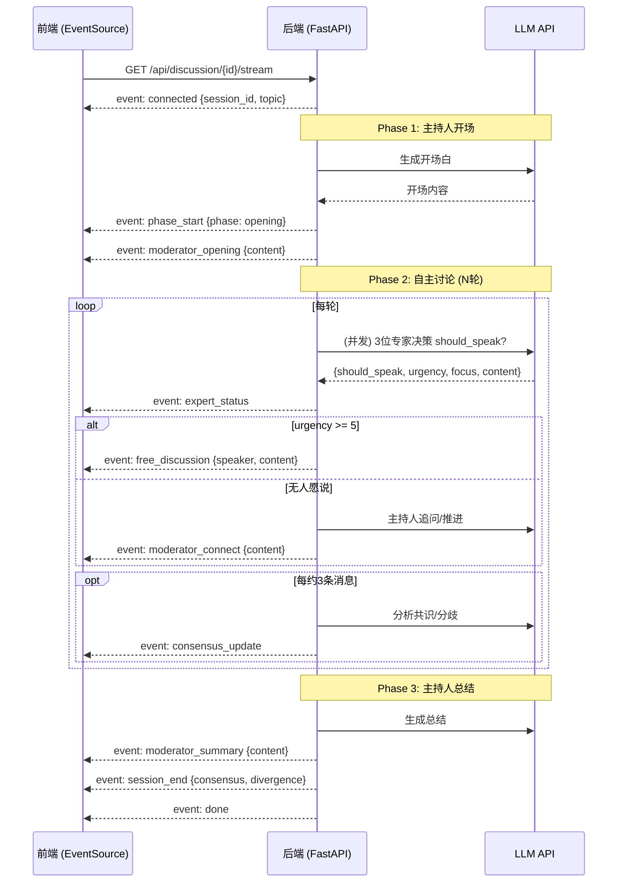

# AI 圆桌讨论 — API 接口设计文档

---

## 1. 基础信息

| 项目 | 说明 |
|------|------|
| **Base URL** | `http://localhost:8000/api` |
| **Content-Type** | `application/json` |
| **字符编码** | UTF-8 |
| **实时通信** | Server-Sent Events (SSE) |
| **数据格式** | 所有响应统一包裹在 `{ code, message, data }` 结构中 |

### 1.1 统一响应格式

```json
{
  "code": 0,
  "message": "ok",
  "data": { ... }
}
```

| 字段 | 类型 | 说明 |
|------|------|------|
| `code` | int | `0` 表示成功，`1` 表示错误 |
| `message` | string | 状态描述，错误时为错误码 |
| `data` | object / array / null | 实际返回数据 |

---

## 2. 接口列表

### 2.1 获取嘉宾列表

```
GET /api/experts
```

获取所有 6 位预设 AI 嘉宾信息。

#### 请求参数

无

#### 请求示例

```bash
curl http://localhost:8000/api/experts
```

#### 响应格式

```json
{
  "code": 0,
  "message": "ok",
  "data": [
    {
      "id": "eff_expert",
      "name": "效率专家",
      "avatar": "⚡",
      "description": "专注于流程优化、时间管理和资源利用效率",
      "personality": "追求极致效率，相信正确的方法论可以解决大多数问题"
    },
    {
      "id": "prod_mgr",
      "name": "产品经理",
      "avatar": "🎯",
      "description": "关注用户需求、市场契合度和产品价值主张",
      "personality": "始终从用户视角出发，数据驱动决策"
    },
    {
      "id": "tech_arch",
      "name": "技术架构师",
      "avatar": "🏗️",
      "description": "从系统设计、可扩展性、技术可行性角度切入",
      "personality": "兼顾工程严谨性与创新精神，关注技术债务"
    },
    {
      "id": "biz_analyst",
      "name": "商业分析师",
      "avatar": "📊",
      "description": "以ROI、市场规模、竞争优势为核心分析框架",
      "personality": "一切决策回归商业本质，用数字说话"
    },
    {
      "id": "ux_designer",
      "name": "用户体验设计师",
      "avatar": "🎨",
      "description": "以可用性、交互逻辑和用户心理模型为出发点",
      "personality": "坚信好的设计是让用户感知不到设计的存在"
    },
    {
      "id": "crit_thinker",
      "name": "批判性思考者",
      "avatar": "🔍",
      "description": "挑战假设、挖掘逻辑漏洞、找出潜在风险",
      "personality": "魔鬼代言人，对所有看似正确的结论保持警惕"
    }
  ]
}
```

#### 响应字段说明

| 字段 | 类型 | 说明 |
|------|------|------|
| `id` | string | 嘉宾唯一标识，用于创建讨论时传入 |
| `name` | string | 中文角色名 |
| `avatar` | string | 图标 emoji |
| `description` | string | 一句话角色定位 |
| `personality` | string | 角色思维特征描述 |

---

### 2.2 AI 生成嘉宾阵容


根据话题由 LLM 生成专属专家阵容（1位主持 + 5-6位专家），用户可勾选确认。

---

## 2.3 创建讨论会话

```
POST /api/discussion/start
```

创建一个新的讨论会话。创建成功后立即开始讨论（可立即连接 SSE 流），状态为 `active`。

#### 请求参数

| 参数 | 位置 | 类型 | 必填 | 校验 | 说明 |
|------|------|------|------|------|------|
| `topic` | body | string | 是 | 1-200 字符 | 讨论话题 |
| `guest_ids` | body | string[] | 是 | 长度必须为 3，元素不重复 | 3 位嘉宾 ID 列表 |

#### 请求体 Schema

```json
{
  "topic": "远程办公是否应该成为互联网公司的默认工作模式？",
  "guest_ids": ["eff_expert", "tech_arch", "crit_thinker"]
}
```

#### 请求示例

```bash
curl -X POST http://localhost:8000/api/discussion/start \
  -H "Content-Type: application/json" \
  -d '{
    "topic": "远程办公是否应该成为互联网公司的默认工作模式？",
    "guest_ids": ["eff_expert", "tech_arch", "crit_thinker"]
  }'
```

#### 成功响应 (201 Created)

```json
{
  "code": 0,
  "message": "ok",
  "data": {
    "id": "550e8400-e29b-41d4-a716-446655440000",
    "topic": "远程办公是否应该成为互联网公司的默认工作模式？",
    "guests": [
      { "id": "eff_expert", "name": "效率专家", "avatar": "⚡" },
      { "id": "tech_arch", "name": "技术架构师", "avatar": "🏗️" },
      { "id": "crit_thinker", "name": "批判性思考者", "avatar": "🔍" }
    ],
    "status": "active",
    "messages": [],
    "created_at": "2026-06-26T12:00:00Z",
    "completed_at": null
  }
}
```

#### 响应字段说明

| 字段 | 类型 | 说明 |
|------|------|------|
| `id` | string (UUID) | 讨论会话唯一标识，用于后续连接 SSE 流 |
| `topic` | string | 讨论话题 |
| `guests` | array | 选中的 3 位嘉宾摘要（id + name + avatar） |
| `status` | string | `active`（进行中）/ `completed`（已完成）/ `error`（异常） |
| `messages` | array | 消息列表，初始为空 |
| `created_at` | string (ISO 8601) | 创建时间 |
| `completed_at` | string \| null | 完成时间，初始为 null |

#### 错误响应

| HTTP 状态码 | code | 说明 |
|------------|------|------|
| 400 | `VALIDATION_ERROR` | 参数校验失败（见下方详情） |
| 500 | `INTERNAL_ERROR` | 服务器内部错误 |

**校验失败详情：**

```json
// topic 为空
{
  "code": 1,
  "message": "VALIDATION_ERROR",
  "data": {
    "detail": "topic: 确保此值至少包含1个字符"
  }
}

// 嘉宾数不足
{
  "code": 1,
  "message": "VALIDATION_ERROR",
  "data": {
    "detail": "guest_ids: 列表长度必须正好为3"
  }
}

// 无效的嘉宾 ID
{
  "code": 1,
  "message": "VALIDATION_ERROR",
  "data": {
    "detail": "无效的嘉宾 ID: invalid_id"
  }
}

// 嘉宾 ID 重复
{
  "code": 1,
  "message": "VALIDATION_ERROR",
  "data": {
    "detail": "嘉宾 ID 不能重复"
  }
}
```

---

### 2.3 SSE 流式讨论

```
GET /api/discussion/{id}/stream
```

建立 Server-Sent Events 连接，实时接收讨论内容。讨论按 4 个阶段依次推送：开场 → 嘉宾立场陈述 → 自由讨论 → 总结。

#### 请求参数

| 参数 | 位置 | 类型 | 必填 | 说明 |
|------|------|------|------|------|
| `id` | path | string (UUID) | 是 | 讨论会话 ID（由创建接口返回） |

#### 请求示例

```bash
curl -N http://localhost:8000/api/discussion/550e8400-e29b-41d4-a716-446655440000/stream
```

前端连接方式：
```javascript
const es = new EventSource(
  `http://localhost:8000/api/discussion/${sessionId}/stream`
);
```

#### SSE 事件类型总览

| 事件类型 | 触发时机 | 阶段 |
|---------|---------|------|
| `connected` | SSE 连接建立 | — |
| `phase_start` | 每个讨论阶段开始 | 全部阶段 |
| `moderator_opening` | 主持人开场发言完成 | 第一阶段：开场 |
| `guest_statement` | 每位嘉宾立场陈述完成 | 第二阶段：陈述 |
| `phase_end` | 每个阶段结束 | 全部阶段 |
| `free_discussion` | 自由讨论每轮每位嘉宾发言完成 | 第三阶段：自由讨论 |
| `moderator_summary` | 主持人总结完成 | 第四阶段：总结 |
| `session_end` | 整场讨论结束 | — |
| `done` | 流关闭 | — |
| `error` | 讨论中发生错误 | — |

#### SSE 事件详细定义

##### 2.3.1 `connected` — 连接建立

```json
{
  "event": "connected",
  "data": {
    "session_id": "550e8400-...",
    "topic": "远程办公是否应该成为...",
    "message": "讨论即将开始..."
  }
}
```

##### 2.3.2 `phase_start` — 阶段开始

```json
{
  "event": "phase_start",
  "data": {
    "phase": "opening",
    "round": 0
  }
}
```

| data 字段 | 类型 | 说明 |
|-----------|------|------|
| `phase` | string | `opening` / `statements` / `free_discussion` / `summary` |
| `round` | int | 轮次：开场/总结为 0，陈述为 1，自由讨论为 2-3 |

##### 2.3.3 `moderator_opening` — 主持人开场

```json
{
  "event": "moderator_opening",
  "data": {
    "id": "msg-uuid-001",
    "session_id": "550e8400-...",
    "phase": "opening",
    "round": 0,
    "speaker_id": "moderator",
    "speaker_name": "主持人",
    "content": "各位嘉宾大家好，今天我们讨论的话题是「远程办公是否应该成为互联网公司的默认工作模式？」...",
    "sequence": 1,
    "created_at": "2026-06-26T12:00:05Z"
  }
}
```

| data 字段 | 类型 | 说明 |
|-----------|------|------|
| `id` | string | 消息唯一 ID |
| `speaker_id` | string | 发言者标识，`moderator` 为主持人 |
| `speaker_name` | string | 发言者显示名称 |
| `content` | string | 发言正文，约 150-250 字 |
| `sequence` | int | 全局消息序号，从 1 递增 |

##### 2.3.4 `guest_statement` — 嘉宾立场陈述

```json
{
  "event": "guest_statement",
  "data": {
    "id": "msg-uuid-002",
    "session_id": "550e8400-...",
    "phase": "statements",
    "round": 1,
    "speaker_id": "eff_expert",
    "speaker_name": "效率专家",
    "content": "从效率的角度来看，远程办公能够显著减少通勤时间...",
    "sequence": 2,
    "created_at": "2026-06-26T12:00:12Z"
  }
}
```

每位嘉宾按创建时传入的顺序依次发言，每人 200-350 字。

##### 2.3.5 `free_discussion` — 自由讨论发言

```json
{
  "event": "free_discussion",
  "data": {
    "id": "msg-uuid-005",
    "session_id": "550e8400-...",
    "phase": "free_discussion",
    "round": 2,
    "speaker_id": "crit_thinker",
    "speaker_name": "批判性思考者",
    "content": "我想回应一下效率专家的观点...",
    "sequence": 5,
    "created_at": "2026-06-26T12:00:28Z"
  }
}
```

| data 字段 | 类型 | 说明 |
|-----------|------|------|
| `round` | int | 2-3，表示第几轮自由讨论 |

##### 2.3.6 `phase_end` — 阶段结束

```json
{
  "event": "phase_end",
  "data": {
    "phase": "statements"
  }
}
```

##### 2.3.7 `moderator_summary` — 主持人总结

```json
{
  "event": "moderator_summary",
  "data": {
    "id": "msg-uuid-014",
    "session_id": "550e8400-...",
    "phase": "summary",
    "round": 0,
    "speaker_id": "moderator",
    "speaker_name": "主持人",
    "content": "经过今天的深入讨论，各位嘉宾从各自的专业视角...",
    "sequence": 14,
    "created_at": "2026-06-26T12:00:45Z"
  }
}
```

总结 300-500 字，综合所有嘉宾观点。

##### 2.3.8 `session_end` — 讨论结束

```json
{
  "event": "session_end",
  "data": {
    "session_id": "550e8400-...",
    "topic": "远程办公是否应该成为...",
    "message_count": 14
  }
}
```

##### 2.3.9 `done` — 流关闭

```json
{
  "event": "done",
  "data": {
    "message": "[DONE]"
  }
}
```

收到此事件后，客户端可主动关闭 EventSource。

##### 2.3.10 `error` — 错误通知

```json
{
  "event": "error",
  "data": {
    "code": "DISCUSSION_ERROR",
    "message": "Anthropic API 调用失败 (HTTP 429): rate limit exceeded"
  }
}
```

#### 完整 SSE 流时序图

```
Client                              Server
  │                                    │
  │──── GET /api/discussion/{id}/stream ────►│
  │                                    │
  │◄─── event: connected ──────────────│  (立即)
  │◄─── event: phase_start ────────────│  phase=opening
  │◄─── event: moderator_opening ──────│  (LLM 生成后推送)
  │                                    │
  │◄─── event: phase_start ────────────│  phase=statements
  │◄─── event: guest_statement ────────│  嘉宾1
  │◄─── event: guest_statement ────────│  嘉宾2
  │◄─── event: guest_statement ────────│  嘉宾3
  │◄─── event: phase_end ─────────────│
  │                                    │
  │◄─── event: phase_start ────────────│  phase=free_discussion
  │◄─── event: free_discussion ────────│  轮次1-嘉宾1
  │◄─── event: free_discussion ────────│  轮次1-嘉宾2
  │◄─── event: free_discussion ────────│  轮次1-嘉宾3
  │◄─── event: phase_end ─────────────│
  │◄─── event: phase_start ────────────│  phase=free_discussion (第2轮)
  │◄─── ...                            │
  │                                    │
  │◄─── event: phase_start ────────────│  phase=summary
  │◄─── event: moderator_summary ──────│  (LLM 生成后推送)
  │◄─── event: session_end ───────────│
  │◄─── event: done ──────────────────│
  │                                    │
  ▼  (连接关闭)                        ▼
```

#### 上游错误响应 (非 SSE)

| HTTP 状态码 | code | 说明 |
|------------|------|------|
| 404 | `SESSION_NOT_FOUND` | 讨论会话不存在 |
| 409 | `SESSION_IN_PROGRESS` | 该讨论已结束，无法继续推送 |

---

### 2.4 获取历史讨论列表

```
GET /api/discussions
```

分页查询历史讨论记录，按创建时间倒序排列。

#### 请求参数

| 参数 | 位置 | 类型 | 必填 | 默认值 | 说明 |
|------|------|------|------|--------|------|
| `page` | query | int | 否 | 1 | 页码，从 1 开始 |
| `page_size` | query | int | 否 | 20 | 每页条数，最大 50 |

#### 请求示例

```bash
curl "http://localhost:8000/api/discussions?page=1&page_size=20"
```

#### 成功响应 (200 OK)

```json
{
  "code": 0,
  "message": "ok",
  "data": {
    "items": [
      {
        "id": "550e8400-e29b-41d4-a716-446655440000",
        "topic": "远程办公是否应该成为互联网公司的默认工作模式？",
        "guests": [
          { "id": "eff_expert", "name": "效率专家", "avatar": "⚡" },
          { "id": "tech_arch", "name": "技术架构师", "avatar": "🏗️" },
          { "id": "crit_thinker", "name": "批判性思考者", "avatar": "🔍" }
        ],
        "status": "completed",
        "message_count": 14,
        "created_at": "2026-06-26T12:00:00Z"
      },
      {
        "id": "660e8400-e29b-41d4-a716-446655440001",
        "topic": "AI 是否会取代初级程序员？",
        "guests": [
          { "id": "prod_mgr", "name": "产品经理", "avatar": "🎯" },
          { "id": "tech_arch", "name": "技术架构师", "avatar": "🏗️" },
          { "id": "biz_analyst", "name": "商业分析师", "avatar": "📊" }
        ],
        "status": "active",
        "message_count": 6,
        "created_at": "2026-06-25T18:30:00Z"
      }
    ],
    "total": 2,
    "page": 1,
    "page_size": 20
  }
}
```

#### 分页字段说明

| 字段 | 类型 | 说明 |
|------|------|------|
| `items` | array | 讨论摘要列表 |
| `total` | int | 总计录数 |
| `page` | int | 当前页码 |
| `page_size` | int | 每页条数 |

#### items 中每项字段说明

| 字段 | 类型 | 说明 |
|------|------|------|
| `id` | string | 讨论 ID |
| `topic` | string | 讨论话题 |
| `guests` | array | 嘉宾摘要 |
| `status` | string | `active` / `completed` / `error` |
| `message_count` | int | 已生成的消息条数 |
| `created_at` | string | 创建时间 (ISO 8601) |

#### 错误响应

| HTTP 状态码 | code | 说明 |
|------------|------|------|
| 400 | `VALIDATION_ERROR` | page 或 page_size 参数非法 |
| 500 | `INTERNAL_ERROR` | 服务器内部错误 |

---

## 3. 错误码汇总

| HTTP 状态码 | code | 适用接口 | 说明 |
|------------|------|---------|------|
| 400 | `VALIDATION_ERROR` | POST /api/discussion/start, GET /api/discussions | 请求参数校验失败 |
| 404 | `SESSION_NOT_FOUND` | GET /api/discussion/{id}/stream | 讨论会话不存在 |
| 409 | `SESSION_IN_PROGRESS` | GET /api/discussion/{id}/stream | 讨论已结束无法继续推送 |
| 500 | `LLM_API_ERROR` | —（出现在 SSE error 事件中） | LLM API 调用失败 |
| 500 | `DISCUSSION_ERROR` | —（出现在 SSE error 事件中） | 讨论过程中发生异常 |
| 500 | `INTERNAL_ERROR` | 所有接口 | 服务器内部错误 |

## 4. 6 位嘉宾 ID 速查表

| ID | 名称 | Avatar | 核心视角 |
|----|------|--------|---------|
| `eff_expert` | 效率专家 | ⚡ | 流程优化、时间管理、资源效率 |
| `prod_mgr` | 产品经理 | 🎯 | 用户需求、市场契合、产品价值 |
| `tech_arch` | 技术架构师 | 🏗️ | 系统设计、可扩展性、技术可行性 |
| `biz_analyst` | 商业分析师 | 📊 | ROI、市场规模、竞争优势 |
| `ux_designer` | 用户体验设计师 | 🎨 | 可用性、交互逻辑、用户心理 |
| `crit_thinker` | 批判性思考者 | 🔍 | 挑战假设、逻辑漏洞、风险评估 |

---

## 5. SSE 事件 Mermaid 时序图



---

## 6. 讨论生命周期

```
POST /api/discussion/generate-guests  ← 1. LLM生成嘉宾阵容
        │
POST /api/discussion/start            ← 2. 确认并创建会话
        │
        ▼
GET /api/discussion/{id}/stream       ← 3. 连接 SSE 流
        │
        ├─ event: connected
        ├─ event: phase_start (opening)
        ├─ event: moderator_opening
        ├─ [30轮自主讨论]
        │   ├─ event: expert_status (每轮)
        │   ├─ event: message_start → chunk×N → free_discussion (流式)
        │   ├─ event: moderator_connect (主持人追问)
        │   └─ event: consensus_update (每3轮)
        ├─ event: moderator_summary
        ├─ event: session_end
        └─ event: done
        │
        ▼
    会话状态 → completed (自动更新)
        │
        ▼
GET /api/discussions  →  可查询到此记录
```

---

> 📌 本文档与 [SPEC.md](../SPEC.md) 配套使用。
