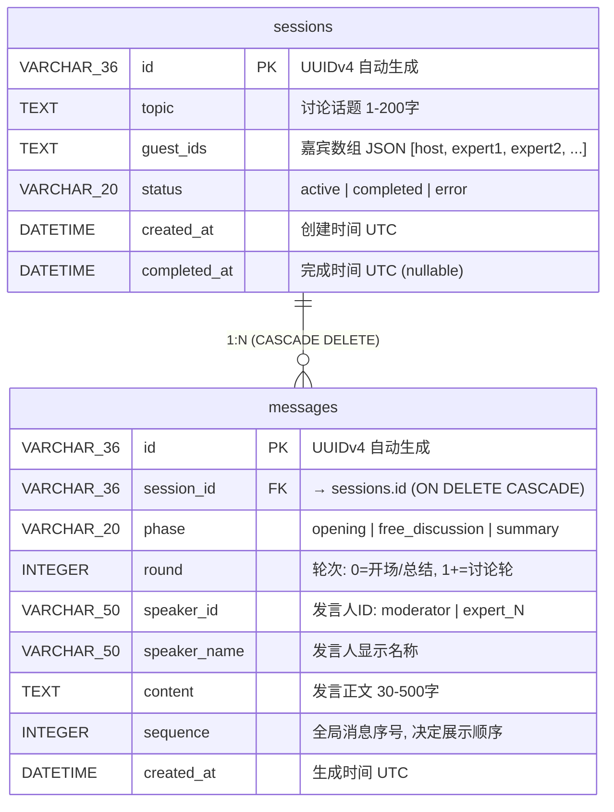
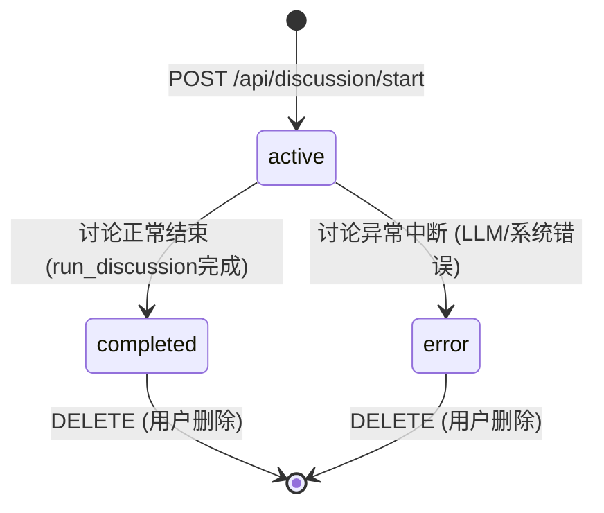
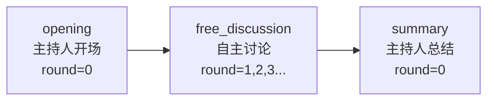

# AI 圆桌讨论 — 数据库设计与 ER 图

---

## 1. ER 图



## 2. 数据字典

### 2.1 sessions 表

| 字段 | 类型 | 约束 | 默认值 | 说明 |
|------|------|------|--------|------|
| `id` | VARCHAR(36) | PK, NOT NULL | UUIDv4 | 讨论唯一标识 |
| `topic` | TEXT | NOT NULL | — | 讨论话题 |
| `guest_ids` | TEXT | NOT NULL | — | JSON 数组：`[{id, name, title, stance, avatar, color}]` |
| `status` | VARCHAR(20) | NOT NULL | `active` | `active` → `completed` / `error` |
| `created_at` | DATETIME | NOT NULL | UTC now | 创建时间 |
| `completed_at` | DATETIME | NULL | — | 讨论结束时间（完成或异常时写入） |

**索引建议**：
```sql
CREATE INDEX idx_sessions_status ON sessions(status);
CREATE INDEX idx_sessions_created_at ON sessions(created_at DESC);
```

### 2.2 messages 表

| 字段 | 类型 | 约束 | 默认值 | 说明 |
|------|------|------|--------|------|
| `id` | VARCHAR(36) | PK, NOT NULL | UUIDv4 | 消息唯一标识 |
| `session_id` | VARCHAR(36) | FK → sessions.id, CASCADE | — | 所属讨论 |
| `phase` | VARCHAR(20) | NOT NULL | — | 阶段枚举 |
| `round` | INTEGER | NOT NULL | 1 | 轮次编号 |
| `speaker_id` | VARCHAR(50) | NOT NULL | — | 发言人标识 |
| `speaker_name` | VARCHAR(50) | NOT NULL | — | 发言人名称 |
| `content` | TEXT | NOT NULL | — | 发言正文 |
| `sequence` | INTEGER | NOT NULL | — | 全局排序序号 |
| `created_at` | DATETIME | NOT NULL | UTC now | 生成时间 |

**索引建议**：
```sql
CREATE INDEX idx_messages_session_id ON messages(session_id);
CREATE INDEX idx_messages_sequence ON messages(session_id, sequence);
```

### 2.3 guest_ids JSON 结构

```json
[
  {
    "id": "moderator",
    "name": "陈锐",
    "title": "资深商业主持人",
    "stance": "保持中立，引导深度讨论",
    "avatar": "🎤",
    "color": "#F59E0B"
  },
  {
    "id": "expert_0",
    "name": "张明远",
    "title": "组织行为学教授",
    "stance": "支持混合办公，强调数据驱动的管理决策",
    "avatar": "📚",
    "color": "#3B82F6"
  }
]
```

## 3. 状态机



## 4. 阶段枚举



| phase | round | speaker | 说明 |
|-------|-------|---------|------|
| `opening` | 0 | moderator | 主持人开场白 |
| `free_discussion` | 1, 2, 3... | expert_N / moderator | 专家自主讨论 + 主持人追问 |
| `summary` | 0 | moderator | 主持人总结收尾 |

## 5. 发言人 ID 规范

| speaker_id | 角色 | 来源 |
|-----------|------|------|
| `moderator` | 主持人 | LLM 动态生成 |
| `expert_0` | 第 1 位专家 | LLM 动态生成 |
| `expert_1` | 第 2 位专家 | LLM 动态生成 |
| `expert_N` | 第 N+1 位专家 (最多 5 位) | LLM 动态生成 |
