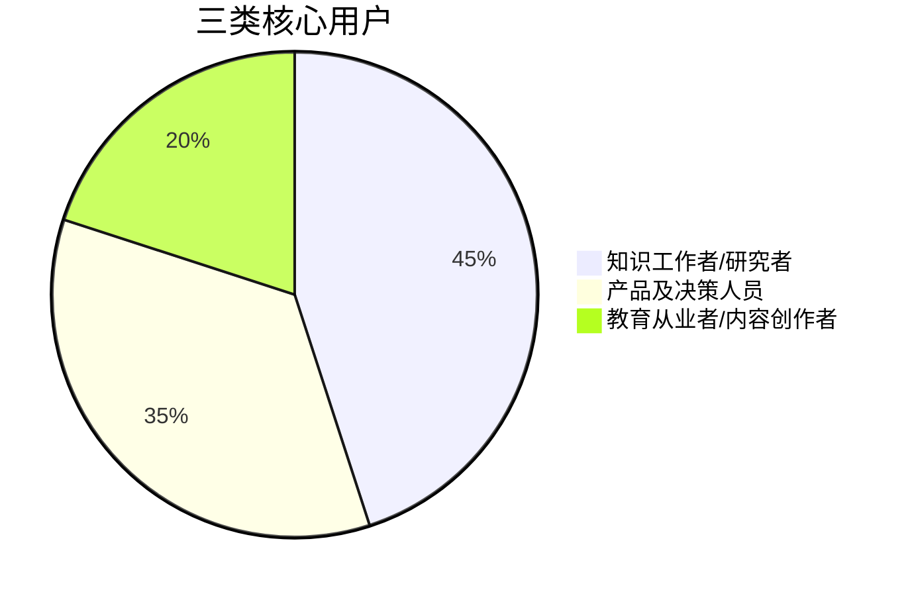
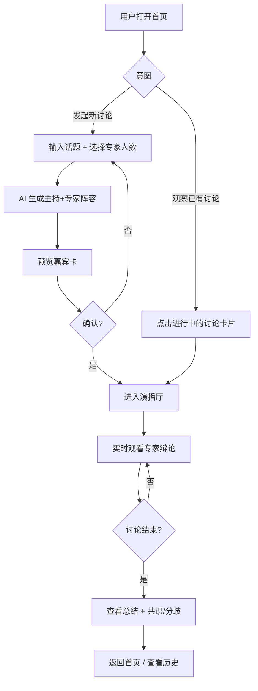
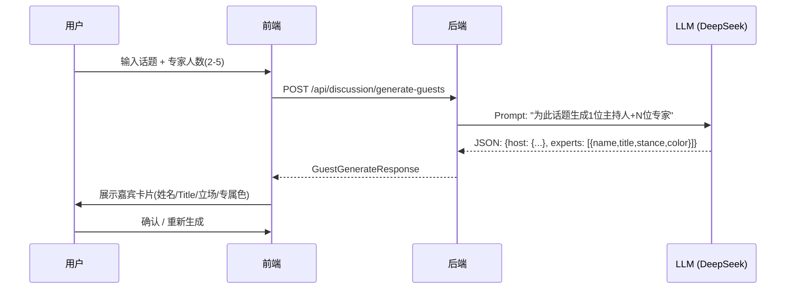
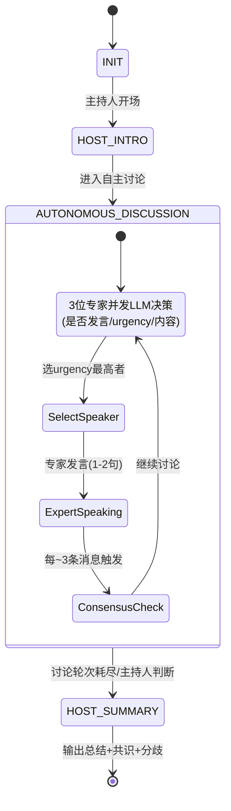
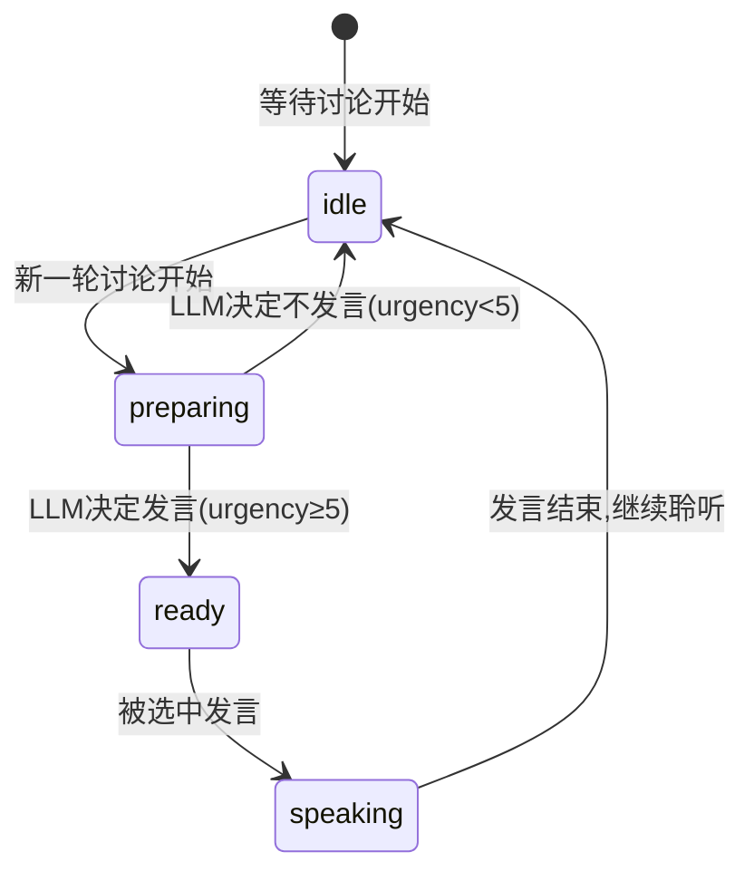

# AI 圆桌讨论 — 产品需求文档 (PRD)

---

## 1. 产品定位

### 1.1 一句话描述

**AI Roundtable** 是一个基于大语言模型的沉浸式圆桌讨论平台——用户输入话题，AI 动态生成专家阵容，专家自主辩论，实时输出观点碰撞。

### 1.2 目标用户

| 用户群体 | 核心痛点 | 核心诉求 |
|---------|---------|---------|
| **知识工作者/研究者** | 时间有限，需快速获取多角度分析 | 几分钟内获得不同视角的深度分析与争辩摘要 |
| **产品及决策人员** | 方案评审前缺少预演场景 | 预演各方立场与潜在争议，发现思考盲点 |
| **教育从业者/内容创作者** | 复杂议题缺乏结构化呈现 | 生成可录制、可回放的 "虚拟专家访谈" 素材 |

### 1.3 用户故事

---

## 2. 核心功能

### 2.1 动态嘉宾生成

### 2.2 自主辩论引擎

### 2.3 实时状态追踪

每位专家有独立的 Agent 状态机：

### 2.4 共识与分歧提炼

- **触发频率**：每约 3 条新消息触发一次分析
- **提取方式**：LLM 分析近期 Transcript → JSON → 前端实时更新面板
- **累积策略**：跨轮次累加，去重，不覆盖已有观点
- **展示位置**：演播厅右侧独立面板 + 结束时总结卡片

---

## 3. 功能范围

### 3.1 MVP（已完成 ✅）

| 功能 | 状态 |
|------|------|
| 动态 LLM 生成嘉宾阵容（主持+2-5位专家） | ✅ |
| 自主辩论引擎（专家 self-decide 发言时机） | ✅ |
| SSE 实时推送（12 种事件类型） | ✅ |
| 演播厅三栏布局（专家状态/Transcript/共识追踪） | ✅ |
| 实时共识与分歧提炼 | ✅ |
| 自然语言总结（非 JSON） | ✅ |
| 进行中讨论列表 + 加入观察 | ✅ |
| 历史记录 + 回放 | ✅ |
| 响应式布局（三断点适配） | ✅ |
| 多会话 SSE 隔离 | ✅ |
| API Key 仅后端环境变量 | ✅ |
| 数据库种子数据（5 条样例） | ✅ |
| 单元测试（52 个） | ✅ |

### 3.2 后续改进方向

| 优先级 | 功能 | 说明 |
|--------|------|------|
| P0 | 讨论录制与导出 | 将 Transcript + 总结导出为 Markdown/PDF |
| P0 | 用户自定义专家 | 允许用户手动编辑生成的嘉宾信息 |
| P1 | 多语言支持 | 英文 UI + 英文讨论 |
| P1 | 讨论分享链接 | 生成可分享的只读链接 |
| P1 | 预设嘉宾模板 | 保存常用嘉宾配置 |
| P2 | 语音合成 | TTS 将发言转为语音，增强沉浸感 |
| P2 | 嘉宾头像 AI 生成 | 替代 emoji，用 AI 生成真人风格头像 |
| P2 | 讨论热度可视化 | 实时显示讨论活跃度、嘉宾参与度图表 |
| P3 | OAuth 登录 | 用户系统，个人讨论历史 |
| P3 | WebSocket 替代 SSE | 支持双向通信（允许真人用户介入讨论） |

---

## 4. 非功能性需求

| 类别 | 要求 | 实现方式 |
|------|------|---------|
| **API Key 安全** | 绝对不能暴露到浏览器 | `.env` 文件仅后端读取；前端通过 `/api` 代理 |
| **多会话隔离** | 不同讨论的状态/事件流/Transcript 完全隔离 | session_id FK + Context 按页实例隔离 |
| **实时性** | 发言生成后 1s 内推送到前端 | SSE StreamingResponse + asyncio 非阻塞 |
| **响应式** | 超宽/桌面/窄屏合理布局 | Tailwind 三断点(1024/1536) + 独立滚动容器 |
| **并发支持** | 10+ 场讨论同时进行 | SQLite WAL 模式 + aiosqlite 异步 |
| **错误恢复** | LLM 失败不丢失已生成内容 | 每条消息即时写 DB；隔离失败(skip guest) |
